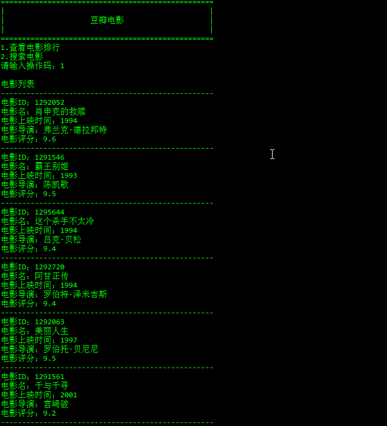
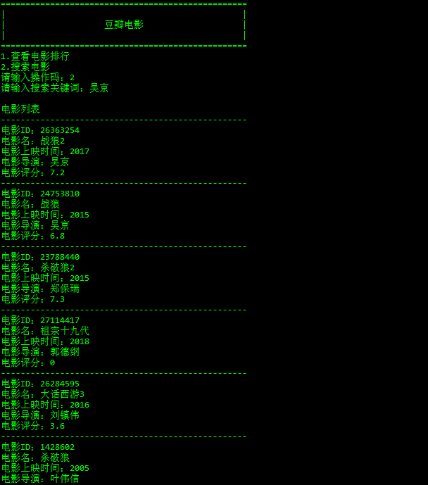
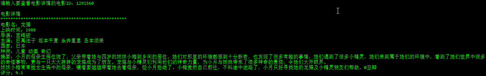

## 豆瓣电影爬虫

使用python2和requests库

利用豆瓣提供的三条API接口，来获取数据

	豆瓣电影top250
	https://api.douban.com/v2/movie/top250'
	查看电影介绍详情，需要传入电影ID
	https://api.douban.com/v2/movie/subject/<movie_id>'
	根据关键词搜索电影
	https://api.douban.com/v2/movie/search?q=<keyword>'

## 效果截图  

电影排行  

搜索电影  

查看电影详情  

