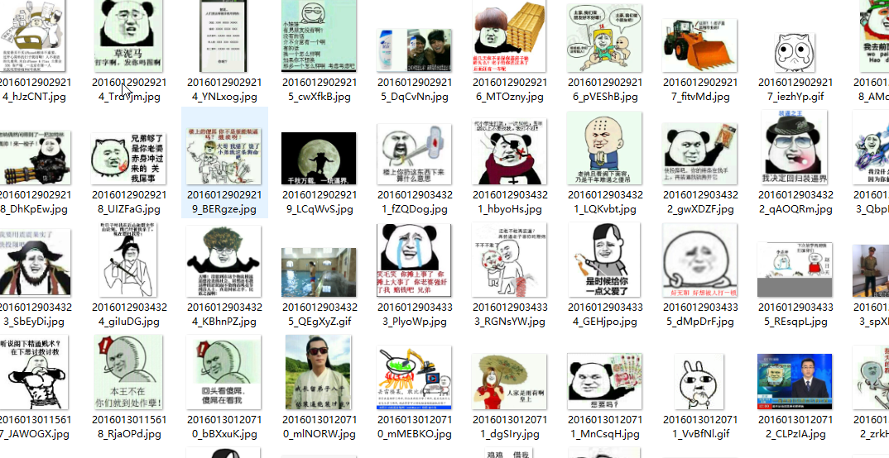

## 多线程爬取斗图表情包

爬取 [斗图啦](https://www.doutula.com/photo/list/) 斗图表情图，做一名优雅的斗图帝！！！

使用python2编写，用到requests库发送请求，BeautifulSoup进行数据提取，`urllib.urlretrieve()`下载表情包。

最主要的是利用到了多线程，不过只是简单的多线程，没有使用队列，而是使用了threading模块自带的线程锁，多线程还需要进行优化。

最后来一张效果图：

emm 几分钟爬了一万多张，大小有五百多M，多线程还是挺快的。。。