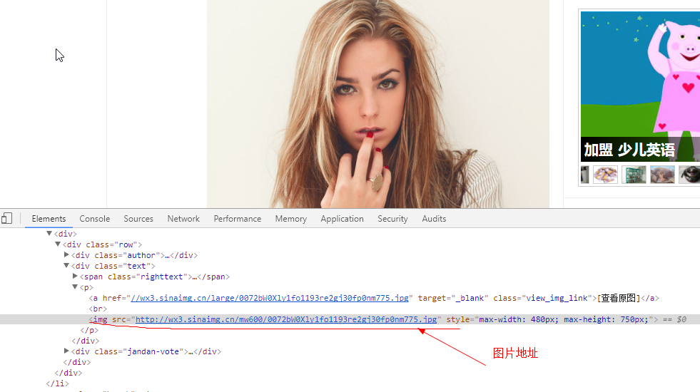
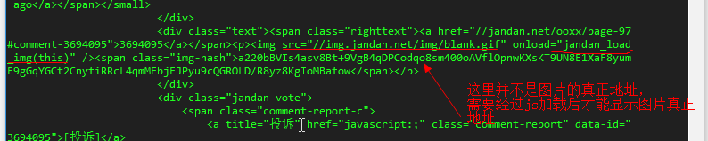

##煎蛋网妹子图

又是妹子图，都有点营养不良了。。。但是，不阅尽天下妹子，怎么做一只高贵的单身汪  

好了，开始爬妹子吧，，啊不，是爬妹子图  

Go Go Go!!!  

首先，分析网页结构:
     

img标签在p标签下，在这里我准备利用lxml库进行数据提取  

如果没有安装，直接	`pip install lxml`安装   
	
	# 使用 lxml 的 etree 库
	from lxml import etree
	# 将字符串解析为HTML文档
	html = etree.HTML(data)
	# 利用XPath提取url
	result = html.xpath('//p/img/@src')
	

在加上非常友好的requests库，相当完美  

爬取妹子图首页：[http://jandan.net/ooxx](http://jandan.net/ooxx "煎蛋网")    

然而页面返回如下：

what fuck！！！ （内心问候祖宗十八代）  

放弃吗？答案是否定的，谁也不能阻挡我看妹子的决心  

动用神器selenium+phantomjs   

selenium安装：`pip install selenium`

phantomjs安装：只能从它的官方网站[http://phantomjs.org/download.html](http://phantomjs.org/download.html)下载

	from selenium import webdriver
	# 使用phantomjs浏览器创建浏览器对象
	# 在环境变量中需要设置Phantomjs浏览器地址
	driver = webdriver.PhantomJS()
	# driver = webdriver.PhantomJS(executable_path='./phantomjs')
	# 加载网页
	driver.get(url)
	# 获取网页渲染后的源代码
	data = driver.page_source.encode('utf-8')

OK, 能获取到图片真正地址了  
 
好了，最后成果如下：    

  

我看妹子去了。。。
