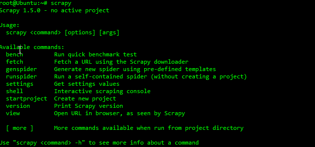
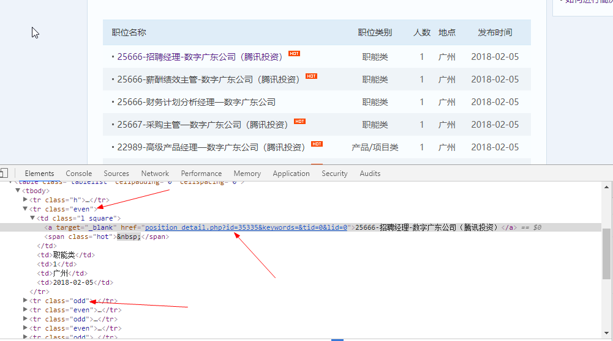
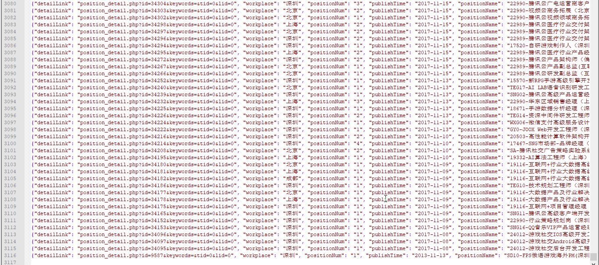

## scrapy框架实战招聘网站爬虫

说到python的爬虫框架，就不得不说说强大的scrapy爬虫框架

>Scrapy，Python开发的一个快速、高层次的屏幕抓取和web抓取框架，用于抓取web站点并从页面中提取结构化的数据。Scrapy用途广泛，可以用于数据挖掘、监测和自动化测试。  
>———摘自百度百科

通过实战来学习scrapy框架，体会scrapy的魅力所在

#### 安装scrapy框架

	pip install scrapy

安装完毕后，在命令行输入scrapy，如果出现下面的提示，代表安装成功  

#### 新建一个爬虫项目

	scrapy startproject mySpider
	# mySpider为你新建的爬虫项目名，这里我的项目叫mySpider

上述命令执行后，scrapy会自动为我们生成几个模板文件，方便我们编写爬虫

生成的项目目录结构： 
 
	.
	└── mySpider
	    ├── mySpider
	    │   ├── __init__.py
	    │   ├── items.py
	    │   ├── middlewares.py
	    │   ├── pipelines.py
	    │   ├── __pycache__
	    │   ├── settings.py
	    │   └── spiders
	    │       ├── __init__.py
	    │       └── __pycache__
	    └── scrapy.cfg

目录文件说明：

* mySpider：项目目录
* scrapy.cfg：项目配置文件
* mySpider/mySpider/：存放项目python文件的目录
* mySpider/mySpider/spiders/：爬虫代码文件存放目录
* mySpider/mySpider/items.py：项目的目标文件，用来定义结构化数据字段，用来以后方便保存爬取到的数据
* mySpider/mySpider/middlewares：爬虫中间件文件
* mySpider/mySpider/pipelines.py：项目的管道文件，用来定义数据的存储
* mySpider/mySpider/settings.py：爬虫的配置文件

简单了解下了目录与文件的作用后，下面开始真正编写爬虫

首先，先来看看我们要实战的网站 [腾讯招聘](https://hr.tencent.com/position.php?&start=0)

  
通过查看网站，我们知道要爬取的数据为职位名称、职位详情链接、职位类别、人数、地点、发布时间  

通过查看网页结构，我们可以发现，我们要的数据都存放在tr标签中，我们可以通过tr标签的class属性来获取tr标签，不过这里需要注意的是，class属性值是隔一个相同。

明确了要爬取的数据后，我们来编辑items.py文件

	import scrapy
	
	# 创建一个类，继承自scrapy.Item
	class TencentItem(scrapy.Item):
		# 定义结构化数据字段，scrapy.Field()将字段定义为item对象
	    positionName = scrapy.Field()
	    detailLink = scrapy.Field()
	    positionType = scrapy.Field()
	    positionNum = scrapy.Field()
	    workplace = scrapy.Field()
	    publishTime = scrapy.Field()

编写完item，开始编写爬虫文件

	cd spiders
	# 使用scrapy命令根据模板为我们自动生成一个爬虫文件，并且指定了爬虫爬取的域名范围
	scrapy genspider tencentSpider "tencent.com"

爬虫文件固定代码说明：
	
	# 定义爬虫的名字
    name = 'tencent'
	# 规定爬虫爬取的域名范围
    allowed_domains = ['tencent.com']
	# 定义爬虫开始爬取的url
    start_urls = ['https://hr.tencent.com/position.php?&start=0']

	# 解析数据的方法
	def parse(self, response):
	
在parse方法中的response参数为一个Response对象，为我们提供了很多方法，方便我们提取数据
	
	# 获取网页数据
	response.body
	# 获取当前请求的url
	response.url

	Response对象还为我们提供了一个xpath的方法，方便我们解析数据
	
	# 获取页面中所有class="even"或class="odd"的tr标签
	response.xpath('//tr[@class="even"]|//tr[@class="odd"]')
	
	# 提取数据
	# extract方法，将列表中的所有元素都转换为Unicode字符串
    positionName = res.xpath('./td[1]/a/text()').extract()[0]
    detailLink = res.xpath('./td[1]/a/@href').extract()[0]
    positionType = res.xpath('./td[2]/text()').extract()[0]
    positionNum = res.xpath('./td[3]/text()').extract()[0]
    workplace = res.xpath('./td[4]/text()').extract()[0]
    publishTime = res.xpath('./td[5]/text()').extract()[0]

	# 将我们获得的数据封装到item对象中
	# 导入我们之前定义好的item文件
	from tencentSpider.items import TencentItem

  	item['positionName'] = positionName
    item['detailLink'] = detailLink
    item['positionType'] = positionType
    item['positionNum'] = positionNum
    item['workplace'] = workplace
    item['publishTime'] = publishTime
	
	# 将item对象交给管道文件，方便我们等下保存数据
	yield item

	# 发送新的url请求加入待爬队列，并调用回调函数 self.parse
    yield scrapy.Request(url, callback = self.parse)

最后编写一下管道文件

	import json
	
	class TencentspiderPipeline(object):
	    def __init__(self):
	        self.file = open('tencent.json', 'w')
	
	    def process_item(self, item, spider):
			# 将获取的数据保存为json文件
	        data = json.dumps(dict(item), ensure_ascii = False) + '\n'
	        self.file.write(data)
	        return item
	
	    def close_spider(self, spider):
	        self.file.close()

process_item方法必须定义，每个item pipeline组件都需要调用该方法，这个方法必须返回一个 Item 对象，被丢弃的item将不会被之后的pipeline组件所处理。  
参数说明  
item (Item 对象) – 被爬取的item，也就是我们传过来的item   
spider (Spider 对象) – 爬取该item的spider  

close_spider方法是可选的，当spider被关闭时，这个方法被调用

编写完管道文件后，我们需要到配置文件中配置一下

打开settings.py文件，配置管道文件

	ITEM_PIPELINES = {
	    'tencentSpider.pipelines.TencentspiderPipeline': 300,
	}

这里，还可以配置下自定义请求头

	DEFAULT_REQUEST_HEADERS = {
	    'User-Agent': "Mozilla/5.0 (Windows NT 10.0; WOW64) AppleWebKit/537.36(KHTML, like Gecko) Chrome/51.0.2704.103 Safari/537.36",
	#   'Accept': 'text/html,application/xhtml+xml,application/xml;q=0.9,*/*;q=0.8',
	#   'Accept-Language': 'en',
	}

完成配置后，开始运行爬虫，在终端输入

	scrapy crawl tencent # 爬虫名

在运行过程中，会看到爬取的过程

最后爬取结果，3116个职位全部爬取下来了

----------

新增继承自CrawlSpider类

	import scrapy
	from scrapy.linkextractors import LinkExtractor
	from scrapy.spiders import CrawlSpider, Rule
	from tencentSpider.items import TencentItem

	class TencentcrawlSpider(CrawlSpider):
    name = 'tencentcrawl'
    allowed_domains = ['tencent.com']
    start_urls = ['https://hr.tencent.com/position.php?&start=0']

    rules = (
    	# LinkExtractor方法创建一个对象，规定要提取的链接
        Rule(LinkExtractor(allow=r'start=\d+'), callback='parse_item', follow=True),
    )

    def parse_item(self, response):